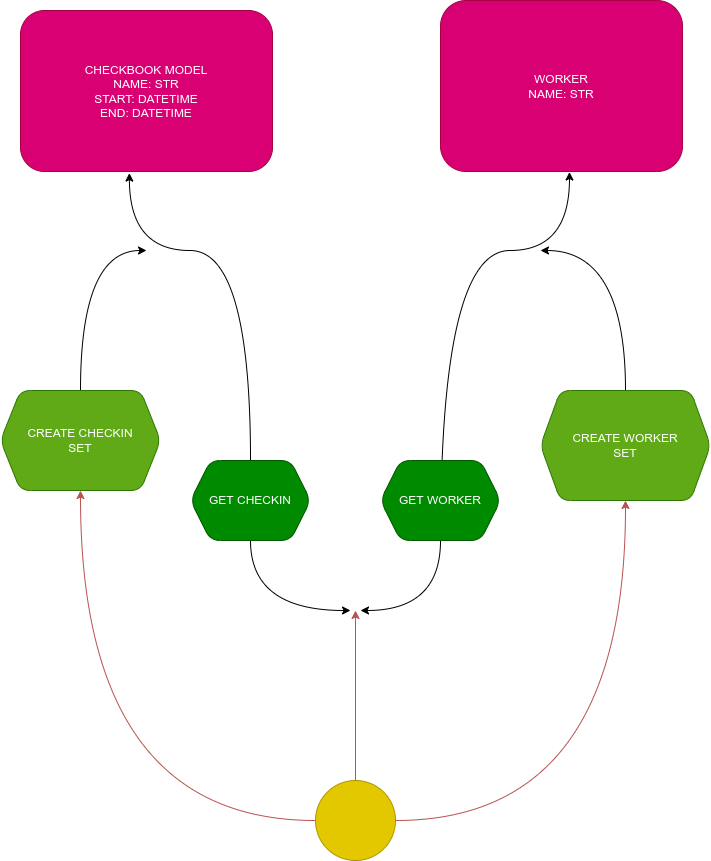

# API & Database Template for a Workplace Session Recorder

## Quick Start

- Clone the repository

    ```bash
    git clone https://github.com/blackprince001/Workplace-Session-Manager
    ```

- Move into the directory

    ```bash
    cd Workplace-Session-Manager
    ```

- Set up a virtual environment with Venv on Vscode or any python environment manager you have installed, and it will automatically install the dependencies.

- To simply install project dependencies, run the command below.

  ```bash
  make install
  ```

- Set up a dev environment by running the command to install dependencies to work on the project. Do note that the make command is already dependent on the one above. So if you use this command, there will be no need for you to run the prev one.
  
  ```bash
    make dev-install
  ```

  while you're in `/Workplace-Session-Manager`

## Other Makefile commands to note

- `make test` - to test the api methods
- `make test-worker` - to test the worker Table in the database
- `make test-checkbook` - to test the checkbook Table in database
- `make pytest-clean` - to clean pytest_cache FILES

## Testing

To run the tests in the project:

- You need to install the dev packages:

  ```bash
  make dev-install
  ```
  
- Run pytest make commands highlighted above

## Architecture Design



## File Structure for Project

```bash
.
├── database.db
├── design.drawio
├── design.png
├── dev-requirements.txt
├── main.py
├── Makefile
├── manager
│   ├── core.py
│   ├── crud
│   │   ├── checker.py
│   │   ├── __init__.py
│   │   └── worker.py
│   ├── __init__.py
│   ├── models.py
│   ├── schema
│   │   ├── checkbook.py
│   │   ├── __init__.py
│   │   └── worker.py
│   └── utils
│       ├── __init__.py
│       └── utils.py
├── README.md
├── requirements.txt
└── tests
    ├── api
    │   ├── __init__.py
    │   ├── test_checkbook_table_api.py
    │   └── test_worker_table_api.py
    ├── conftest.py
    └── __init__.py

6 directories, 24 files
```
